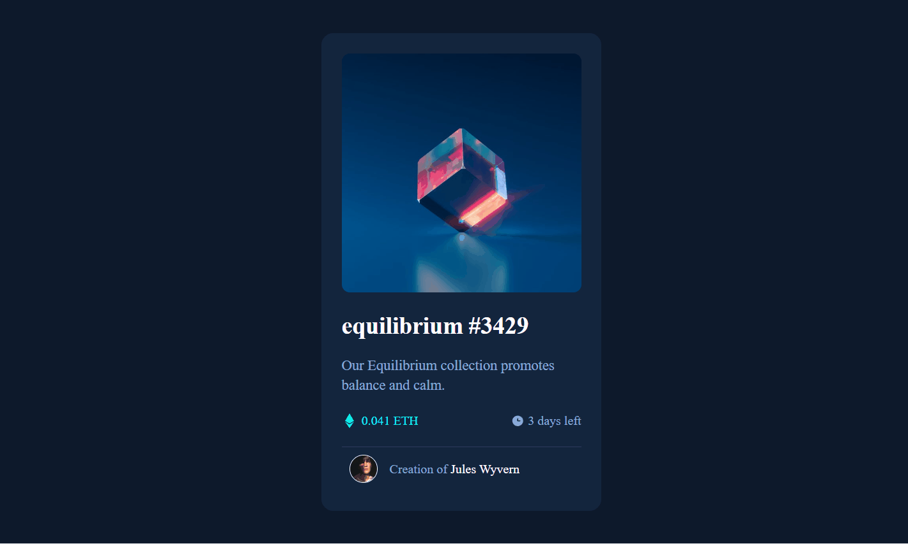

# Projeto 💻

## Sobre 🎯
Projeto de um card, criado atraves do Curso Dev Quest💜

## Tecnologias 🔨
- HTML
- CSS

## Conhecimento adquirido 🧠
a forma de uso de posicionar o back-ground na imagem e neste caso tambem aparecendo um olho quando passa o mouse por cima da imagem.

estarei usando como base nos meus projetos futuros 

